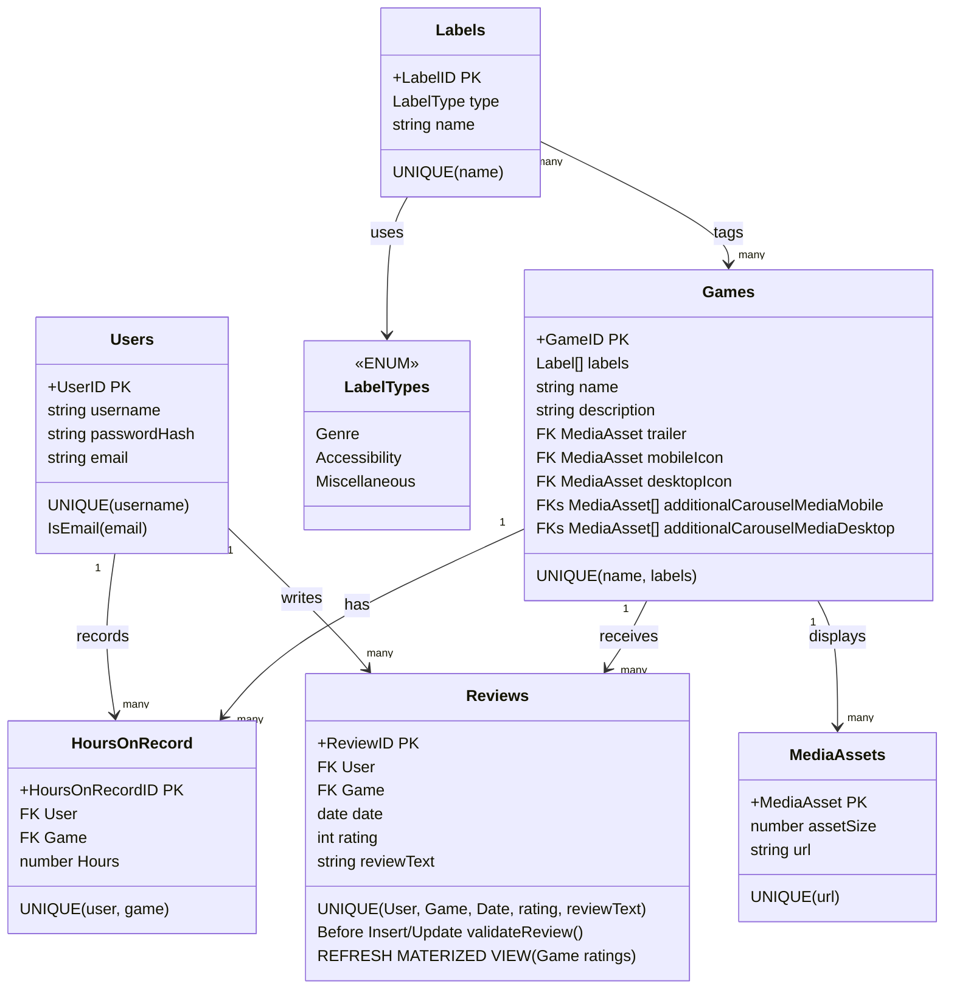

# ER Diagram

```mermaid
classDiagram
    class Users {
	    +UserID PK
	    string username
	    string passwordHash
	    string email
        UNIQUE(username)
        IsEmail(email)
    }

    class HoursOnRecord {
	    +HoursOnRecordID PK
	    FK User
	    FK Game
	    number Hours
        UNIQUE(user, game)
    }

    class Reviews {
	    +ReviewID PK
	    FK User
	    FK Game
	    date date
	    int rating
	    string reviewText
        UNIQUE(User, Game, Date, rating, reviewText)
        Before Insert/Update validateReview() 
        REFRESH MATERIZED VIEW (Game ratings)
    }

    class LabelTypes {
	    Genre
	    Accessibility
	    Miscellaneous
    }

    class Labels {
	    +LabelID PK
	    LabelType type
	    string name
        UNIQUE(name)
    }

    class MediaAssets {
	    +MediaAsset PK
	    number assetSize
	    string url
        UNIQUE(url)
    }

    class Games {
	    +GameID PK
	    Label[] labels
	    string name
	    string description
	    FK MediaAsset trailer
	    FK MediaAsset mobileIcon
	    FK MediaAsset desktopIcon
	    FKs MediaAsset[] additionalCarouselMediaMobile
	    FKs MediaAsset[] additionalCarouselMediaDesktop
        UNIQUE(name, labels)
    }

	<<ENUM>> LabelTypes

    Users "1" --> "many" HoursOnRecord : records
    Games "1" --> "many" HoursOnRecord : has
    Users "1" --> "many" Reviews : writes
    Games "1" --> "many" Reviews : receives
    Labels "many" --> "many" Games : tags
    Labels --> LabelTypes : uses
    Games "1" --> "many" MediaAssets : displays
```