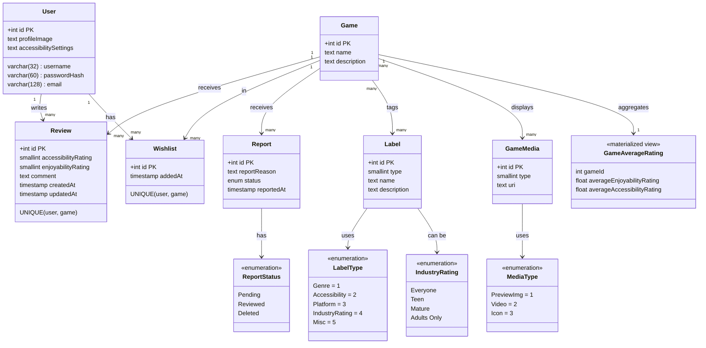

# ER Diagram

```mermaid
classDiagram
    class User {
        +int id PK
        varchar(32) username
        varchar(60) passwordHash
        varchar(128) email
        text profileImage
        text accessibilitySettings
    }

    class Game {
        +int id PK
        text name
        text description
    }

    class Label {
        +int id PK
        smallint type
        text name
        text description
    }

    class LabelType {
        <<enumeration>>
        Genre = 1
        Accessibility = 2
        Platform = 3
        IndustryRating = 4
        Misc = 5
    }

    class IndustryRating {
        <<enumeration>>
        Everyone
        Teen
        Mature
        Adults Only
    }

    class GameMedia {
        +int id PK
        smallint type
        text uri
    }

    class MediaType {
        <<enumeration>>
        PreviewImg = 1
        Video = 2
        Icon = 3
    }

    class Review {
        +int id PK
        smallint accessibilityRating
        smallint enjoyabilityRating
        text comment
        timestamp createdAt
        timestamp updatedAt
        UNIQUE(user, game)
    }

    class Report {
        +int id PK
        text reportReason
        enum status
        timestamp reportedAt
    }

    class ReportStatus {
        <<enumeration>>
        Pending
        Reviewed
        Deleted
    }

    class Wishlist {
        +int id PK
        timestamp addedAt
        UNIQUE(user, game)
    }

    class GameAverageRating {
        <<materialized view>>
        int gameId
        float averageEnjoyabilityRating
        float averageAccessibilityRating
    }

    User "1" --> "many" Review : writes
    Game "1" --> "many" Review : receives
    User "1" --> "many" Wishlist : has
    Game "1" --> "many" Wishlist : in
    Game "1" --> "many" Report : receives
    Game "many" --> "many" Label : tags
    Game "many" --> "many" GameMedia : displays
    Label --> LabelType : uses
    Label --> IndustryRating : can be
    GameMedia --> MediaType : uses
    Report --> ReportStatus : has
    Game "1" --> "1" GameAverageRating : aggregates
```